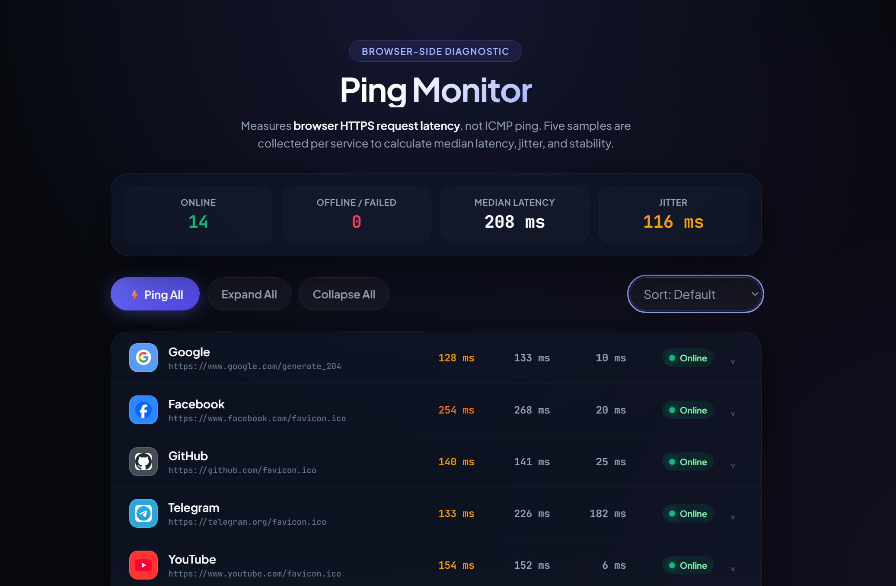

# ⚡ Ping Monitor


## 🌐 Live Demo

- **Cloudflare Worker:** `https://pinging.ai09.workers.dev/`
- **Standalone:** `https://hosseinb1111.github.io/ping-monitor/`



A single-page dashboard that pings a list of popular websites straight from
your browser and reports back on latency, jitter, and stability. There's no
server component doing the measuring — every request originates from the
tab you have open, using `fetch()`.

It ships in two forms that look and behave identically: a Cloudflare Worker
you can deploy in a minute, and a plain `index.html` you can open directly
or drop on any static host.


## ✨ Features

- Browser-side latency measurement — no server ever touches your results
- Five sequential samples per service (never fired in parallel for the same
  service)
- Median, average, best, and worst latency per service
- Jitter, calculated as the standard deviation of successful samples
- Success rate (`successful samples / total samples`)
- Status classification: Online, Degraded, Timeout, Failed, Waiting
- Concurrent testing across services, with a configurable concurrency limit
- Manual **Ping All** — nothing runs automatically or on an interval
- **Expand All** / **Collapse All**, plus a per-service expand control
- Client-side sorting by default order, fastest, slowest, status, or name
- Fully responsive, down to small phones, with no horizontal scrolling
- Dark, glass-panel UI with restrained motion
- Service icons with automatic first-letter fallback if an icon fails to load
- No backend, no account, no API key, no analytics, no tracking

## 🧠 How It Works

This is **not** an ICMP ping tool. Browsers can't send ICMP packets — there's
no OS-level socket access from JavaScript. Instead, each service is measured
by timing a `fetch()` call:

```
start   = performance.now()
attempt = fetch(url, { mode: "no-cors", cache: "no-store", ... })
elapsed = performance.now() - start
```

The elapsed time is the time your browser took to complete an HTTPS request
round trip — DNS lookup, TLS handshake (if a new connection is needed),
and the response headers arriving. It's a reasonable proxy for real-world
reachability and latency, but it is a different measurement than ICMP echo.

Requests are sent with `mode: "no-cors"`. That's a deliberate constraint of
running entirely in the browser without a proxy: it lets the request be sent
cross-origin without the target needing to grant CORS access, but it also
means **the response is opaque** — this app cannot read the HTTP status
code, headers, or body. A "successful" sample means the browser finished
the request without a fetch-level error (no network failure, no abort). It
does **not** mean the server returned `200 OK`, and the app never claims
that it does.

## 📊 Metrics

For a service with successful sample latencies `v1..vn`:

| Metric | Meaning |
|---|---|
| Best | `min(v1..vn)` |
| Worst | `max(v1..vn)` |
| Average | `sum(v1..vn) / n` |
| Median | middle value of the sorted samples (average of the two middle values if `n` is even) |
| Jitter | `sqrt(variance)`, i.e. the standard deviation of the samples — `variance = sum((vi - average)^2) / n` |
| Success rate | `successful samples / total samples` (each service takes 5 total) |

If a service has fewer than two successful samples, jitter is reported as
`0 ms` rather than left undefined. If a service has zero successful samples,
the row shows either "Requests timed out" or "No successful samples"
depending on how the last attempt failed.

## 🌐 Monitored Services

Google · Facebook · GitHub · Telegram · YouTube · Wikipedia · Amazon ·
Reddit · X · Instagram · WhatsApp · Discord · TikTok · Netflix

## 🔒 Privacy

All measurements happen inside your browser. There's no project backend to
send results to, no account, and nothing is logged or stored by this
application.

That said, this tool is not fully private in an absolute sense: to measure
a service, your browser sends a real HTTPS request directly to that
service's servers (Google, Facebook, GitHub, and so on), the same way
loading their favicon in a new tab would. Those third parties see that
request the same way they'd see any other visit. Nothing about that
request is routed through, or visible to, this project.

## ⚠️ Limitations

- Browser fetch timing is not equivalent to ICMP ping and will generally
  read higher, since it includes DNS, TLS, and browser overhead
- `no-cors` mode means HTTP status codes and response bodies are invisible
  to this app — a "success" only means the fetch didn't error
- VPNs, proxies, and corporate firewalls can all skew results
- DNS resolution differences (custom resolvers, DNS-over-HTTPS, ISP DNS)
  affect timing and can affect whether a request completes at all
- Ad blockers and browser extensions can block or delay specific domains
- Network congestion on your own connection affects every sample
- A service can be fully online while your particular request still fails,
  for reasons entirely outside that service's control

## 🚀 Cloudflare Worker

**Dashboard deployment:**

1. Log in to the [Cloudflare dashboard](https://dash.cloudflare.com/)
2. Go to **Workers & Pages → Create → Create Worker**
3. Give it a name and click **Deploy** to scaffold it
4. Click **Edit code**, delete the placeholder contents, and paste in the
   full contents of `worker.js`
5. Click **Save and deploy**

Your Worker URL (something like `ping-monitor.<your-subdomain>.workers.dev`)
now serves the full application.

**Wrangler deployment (optional):**

```bash
npm install -g wrangler
wrangler login
wrangler deploy worker.js --name ping-monitor
```

No `wrangler.toml` is required for this single-file Worker, though you're
free to add one if you want to configure a custom domain or route.

## 💻 Standalone Version

`index.html` is the entire application in one file — open it directly:

```bash
open index.html        # macOS
xdg-open index.html    # Linux
start index.html        # Windows
```

Or deploy it to any static host:

- **GitHub Pages** — commit `index.html` to a repo and enable Pages
- **Netlify** — drag the file onto the Netlify dashboard, or connect the repo
- **Cloudflare Pages** — connect the repo, no build command needed
- Any other static file host works the same way — there's nothing to build

## 🛠️ Customization

**Adding or removing a monitored service** — edit the `SITES` array near
the top of the embedded `<script>` (in both `worker.js` and `index.html`):

```js
{
  name: "Example",
  url: "https://example.com/favicon.ico",
  icon: "https://www.google.com/s2/favicons?sz=64&domain=example.com",
  color: "#6366f1"
}
```

- `url` is the endpoint actually measured
- `icon` is only used for the avatar image and has no effect on timing
- `color` is the avatar's background, shown behind the icon and used for
  the first-letter fallback

**Tuning the test behavior** — edit the `CONFIG` object next to `SITES`:

```js
var CONFIG = {
  samplesPerSite: 5,   // attempts per service, run sequentially
  timeoutMs: 4500,     // abort a single attempt after this many ms
  maxConcurrent: 4,    // how many services are measured at once
  cacheBust: true       // append a random query param to avoid caching
};
```

Remember to make the same edit in both `worker.js` and `index.html` if you
want to keep them in sync.

## 📁 Project Structure

```
ping-monitor/
├── worker.js    Cloudflare Worker — serves the app as an HTML response
├── index.html   Standalone version — the same app as a static file
├── README.md    This file
└── LICENSE      MIT License
```

## ♿ Accessibility

- Every interactive control is a real `<button>` or `<select>`, not a
  clickable `<div>`
- The sort dropdown has an associated, visually-hidden `<label>` and an
  `aria-label`
- Each per-service expand control has `aria-expanded` and an `aria-label`
  that switches between "Show details" and "Hide details"
- Visible `:focus-visible` outlines are used instead of removing the
  browser's default focus indicator
- `prefers-reduced-motion: reduce` disables transitions and smooth
  scrolling for users who've asked for it at the OS level

## 📱 Responsive Design

- **Desktop** — the full multi-column row: name, median, average, jitter,
  status, and the expand control
- **Tablet** — the average column is hidden first to save space
- **Mobile** — only service name, median latency, status, and the expand
  control remain in the row; average and jitter move into the expanded
  detail panel only. URLs truncate with an ellipsis rather than wrapping or
  forcing horizontal scroll

## 📄 License

MIT — see the [LICENSE](LICENSE) file for the full legal text.
